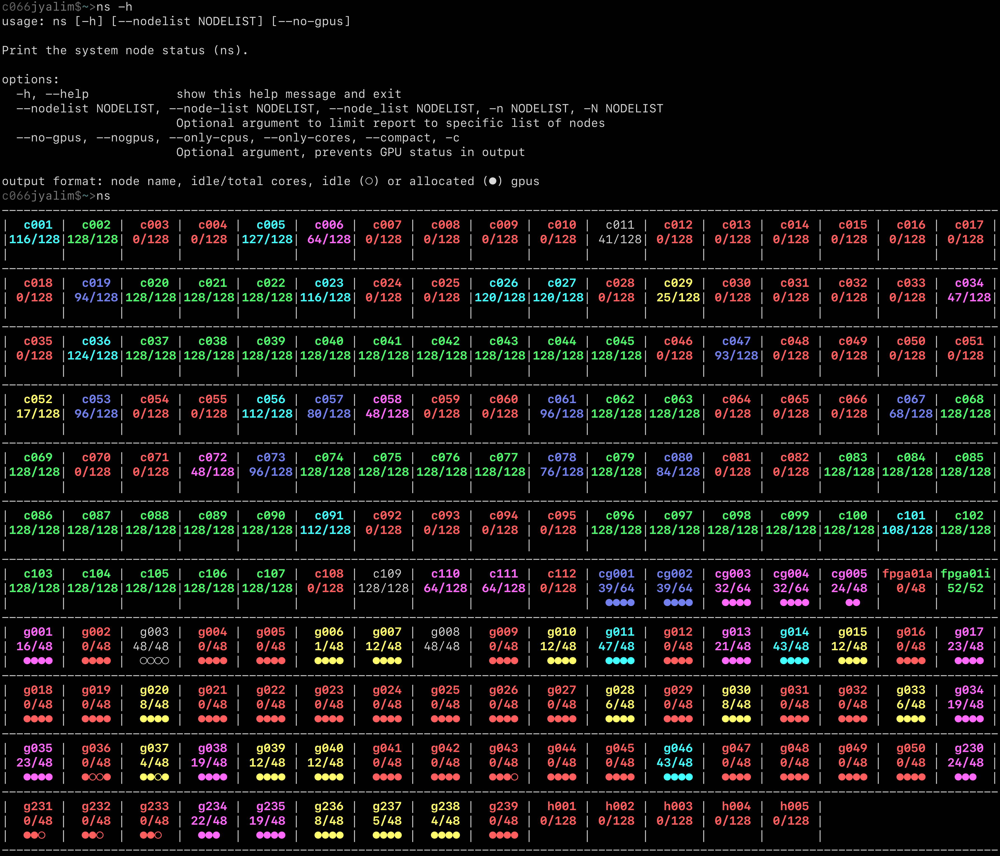

Sol Node Status
===============

Command-line
------------

 
 
  
 

Python script created by Prof. Jay Oswald that converts SLURM node
states into a convenient table summary in arbitrary-width terminals.
Scrapes SLURM via `sinfo` and plots node status with `plotly`.

Open OnDemand Sol Node Status
-----------------------------

  

 
 
  
 

Scrapes SLURM via `sinfo` and plots node status with `plotly`. See the
details, installation notes, and source code in the 
[Sol status page repository][sol-ood-node-status-repo].  

[sol-status]: https://links.asu.edu/sol-status
[example]: https://math.la.asu.edu/~yalim/sol-status-demo.html
[sol-ood-node-status-repo]: https://github.com/jyalim/sol-status-page

